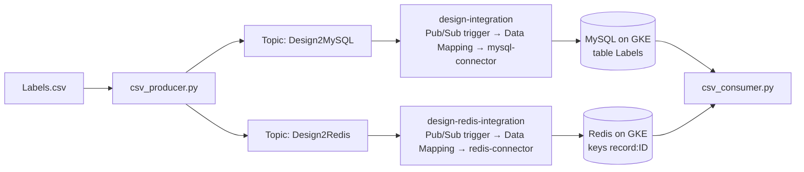

# Milestone 2: Data Storage and Integration Connectors (Design)

**Student:** Ahmad Musleh (101042609)
**Course:** SOFE4630U, Software Development Methods and Tools

This repository contains the design part of Milestone 2. It extends the producer/consumer system from Milestone 1 by adding a **storing stage in the middle**: every record sent by the producer is stored in **MySQL** and in **Redis** by Pub/Sub sink connectors, and the consumer reads the records from the storage instead of directly from Pub/Sub.

## Architecture



| Component | Details |
|---|---|
| Topics | `Design2MySQL` and `Design2Redis` |
| Servers | MySQL (`mysql/mysql-server`) and Redis (`redis`) deployed on a GKE cluster, each exposed by a LoadBalancer service |
| MySQL integration | `design-integration`: Cloud Pub/Sub trigger on `Design2MySQL` → Data Mapping (`CloudPubSubMessage.data` → `connectorInputPayload`) → `mysql-connector` (entity `Labels`, operation `Create`) |
| Redis integration | `design-redis-integration`: Cloud Pub/Sub trigger on `Design2Redis` → Data Mapping (`data` → `Value`, `orderingKey` → `RedisKey`, `"String"` → `RedisType`) → `redis-connector` (entity `Keys`, operation `Create`) |
| MySQL table | `Readings.Labels (ID int primary key, time double, profileName varchar(100), temperature double, humidity double, pressure double)` |
| Redis keys | `record:<ID>`, value = the record as JSON |

## Files

| File | Description |
|---|---|
| `csv_producer.py` | Reads `Labels.csv`, gives each row an `ID`, converts the numeric values from strings to numbers, replaces missing values with `null`, and publishes each record to both topics. The Redis message carries the ordering key `record:<ID>`, which the Redis connector uses as the key. |
| `csv_consumer.py` | Connects to MySQL and Redis. Every second it reads the records it has not printed yet from the `Labels` table and from the `record:*` keys, and prints them. |
| `Labels.csv` | The input data from Milestone 1 (100 readings). |

## Design justification

- **MySQL** fits this data because every reading has the same fixed columns. A relational table keeps the full history of readings and can be queried with SQL (for example, all rows with a missing humidity value).
- **Redis** keeps the data in memory as key/value pairs, so a single record can be read very quickly by its key (`record:<ID>`), which suits fast lookups and caching.
- **Sink connectors** make the storing stage fully managed. No extra code runs between Pub/Sub and the databases, and the same connectors from the lab are reused.
- **Decoupling:** the data is stored before the consumer reads it, so the consumer can be stopped and started again without losing records, unlike Milestone 1.

## Notes from building and testing

- **Message order:** Pub/Sub does not guarantee delivery order, so a record with a smaller ID can be stored after a record with a bigger ID. The consumer therefore keeps a set of the IDs/keys it already printed, instead of only the last ID, so no record is skipped.
- **Missing values:** 22 of the 100 rows have a missing value. They are published as `null` and stored as `NULL` in MySQL.
- **Unique IDs:** the `Create` operation inserts new rows by primary key, so running the producer twice needs the table and the keys to be cleared first (see below).
- **Limitation:** the MySQL and Redis pods do not use a persistent volume, so the data would be lost if a pod is recreated. A PersistentVolumeClaim would fix this in a production setup.

## How to run

1. Deploy MySQL and Redis on GKE (`mysql-deploy.yaml`, `mysql-service.yaml`, `redis.yaml` from the course repository) and create the table:
   ```sql
   use Readings;
   create table Labels( ID int primary key, time double, profileName varchar(100), temperature double, humidity double, pressure double);
   ```
2. Create the topics:
   ```bash
   gcloud pubsub topics create Design2MySQL
   gcloud pubsub topics create Design2Redis
   ```
3. Create and publish `design-integration` and `design-redis-integration` as described in the table above.
4. Put the service account JSON key in this folder (it is excluded by `.gitignore`), set `project_id` in `csv_producer.py`, and set the server IPs in `csv_consumer.py`.
5. Install the libraries and run the consumer, then the producer, in two terminals:
   ```bash
   pip install google-cloud-pubsub pymysql redis
   python csv_consumer.py
   python csv_producer.py
   ```
6. To reset the storage before running again:
   ```bash
   mysql -uusr -psofe4630u -h<MySQL-IP> -e "delete from Readings.Labels;"
   redis-cli -h <Redis-IP> -a sofe4630u --no-auth-warning --scan --pattern 'record:*' | xargs redis-cli -h <Redis-IP> -a sofe4630u --no-auth-warning del
   ```

## Discussion

### What is the difference between source and sink connectors?

The difference is the direction of the data. A **sink connector** takes data **out of** the messaging system and writes it **into** an external system. In this milestone, the MySQL and Redis sink connectors consume the messages from Pub/Sub topics and store them as rows in a table or as key/value pairs. A **source connector** works the other way: it reads data **from** an external system, such as a database or a SaaS application, and publishes it **into** the messaging system as events. For example, a source connector could watch the `SmartMeter` table and publish every new row to a Pub/Sub topic, so other services can react to it. In short, a source connector acts as a producer and a sink connector acts as a consumer, and neither of them needs custom code.

### What are the applications of the connectors?

- **Storing event streams:** saving IoT or sensor readings, like the smart meter data, into databases or data warehouses for history and later analysis.
- **Caching:** keeping the latest or most requested data in a fast in-memory store such as Redis for dashboards and applications.
- **Integrating systems without code:** moving data between cloud services, databases, and third-party SaaS applications (for example CRM or ERP systems) through a standard interface, without writing protocol-specific code.
- **Change data capture:** using source connectors to turn database changes into events, for example a new order in a database triggering a shipping or notification service.
- **Data migration and replication:** copying data from one system to another, such as from an old database to a new one, or keeping a backup copy in sync.

Connectors also handle retries, scaling (connection nodes), and credentials (stored in Secret Manager), which would otherwise have to be built into custom consumer code.
